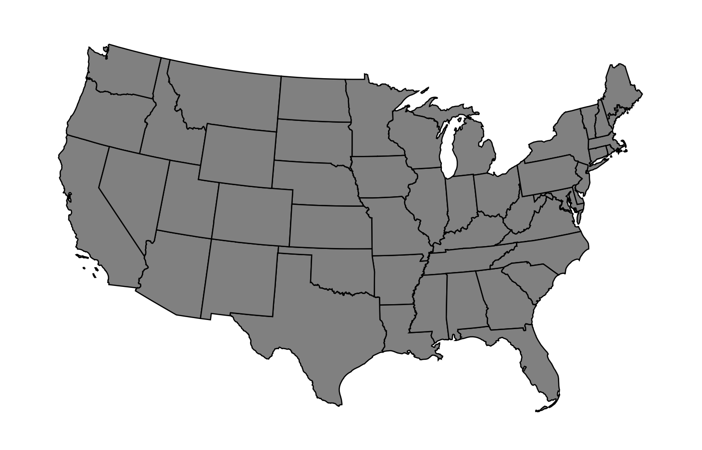
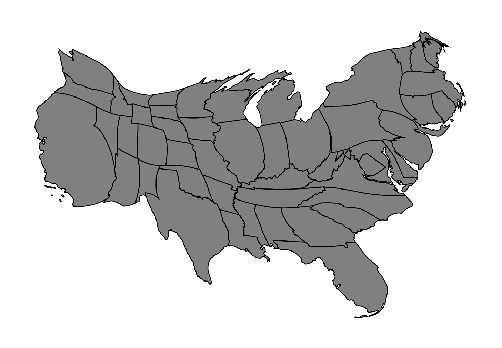

# Flow-Based Cartogram Generator
We present a fast <a href="https://en.wikipedia.org/wiki/Cartogram" target="\_blank" title="What are Cartograms?">cartogram</a> generator written in C. It uses the flow-based algorithm devised by <a href="" target="\_blank">Gastner et. al.</a>

This readme explains how to set up and use this software. In doing so, it uses data from the United States presidential election, 2016. This data is included in the repository.

## Input data format
The cartogram expects two input files:

1. a `.gen` file containing the cartesian coordinates for the map regions under consideration. For example, for the 2016 US presidential election data we provide `usa_low48splitMElo_conic.gen` which includes the coordinates for the boundaries of the different states.

2. a `.dat` file containing the data (such as population) for each region, according to which these will be scaled. For the 2016 US presidential election data we provide `usa_electors.dat` which provides the number of electors for each state.

<!-- We can add some explanation about the files here if needed -->

## Building the cartogram generator

### Dependencies

#### macOS
You must have the `brew` package manager <a href="https://www.moncefbelyamani.com/how-to-install-xcode-homebrew-git-rvm-ruby-on-mac/" title="How to install brew?" target="\_blank">installed</a>  on your computer.

#### Ubuntu/Debian Linux
No additional dependencies. Your default `apt-get` package manager should work fine.

### Building (macOS & Linux)

1. Open a terminal, clone the repository, and navigate to its root directory.

2. Run the provided automatic build script (you may need to grant sudo priveleges):
```
chmod a+x autobuild.sh && ./autobuild.sh
```

3. You should have an executable by the name of `cartogram` in your root directory.

**Note:** If you run into issues, look at the [**Troubleshooting**](#troubleshooting) section below.

## Running the cartogram generator

1. Navigate to the directory with the `cartogram` executable. By default, this should be the root directory of the project.

2. Run the executable using the following command format:
```
./cartogram <.gen file> <.dat file>
```
For the provided 2016 US presidential election data, run the following command:
```
./cartogram usa_low48splitMElo_conic.gen usa_electors.dat
```

**Note:** In our repository, we also include data for India and China's GDP, segmented by their states/provinces.

To generate the India GDP cartogram, run:
```
./cartogram india_noLD_conic.gen india_gdp.dat
```

To generate the China GDP cartogram, run:
```
./cartogram china_withSARandTWN_conic.gen china_gdp.dat
```

3. You should see two generated files - `map.eps` showing the original map, and `cartogram.eps` showing the generated cartogram.

On macOS, open using
```
open <filename>.eps
```
On Linux, open using
```
evince <filename>.eps
```
Replace `<filename>` with the name of the file (`map` or `cartogram`) you wish to open.

For our 2016 US election example, `map.eps` should look like:

<p align="center">

</p>

`cartogram.eps` should look like:

<p align="center">

</p>

## Troubleshooting
### Error: Don't understand 'm' flag!

If you see the following line in your output, you may want to take a look at <a href="https://github.com/dmlc/xgboost/issues/1945" target="\_blank">this solution</a>. Once you have implemented the solution from the link, follow the standard build instructions above.
```
FATAL:/opt/local/bin/../libexec/as/x86_64/as: I don't understand 'm' flag!
```

### Manually building the generator

In case you run into problems while building the generator using the automated script, you could try manually carrying out some of the steps.

#### macOS
1. Install fftw and gcc.
```
brew install fftw && brew link fftw
brew install gcc
```
2. Note down the version of `gcc` installed. For example, if `gcc-7.1.0` is installed, your version would be `7` (not 7.1.0).

3. Go into the source code directory and open the `Makefile`.
```
cd cartogram_generator
vi Makefile
```
4. Change the line `CC = gcc` to `CC = gcc-[your-version-number]` where '_your-version-number_' is the number you noted above. Then save the file using the vi command `:wq`.

5. Go back to the root directory.
```
cd ..
```

6. Run the remaining steps.
```
chmod a+x scripts/semi_autobuild.sh && scripts/semi_autobuild.sh
```

#### Ubuntu/Debian Linux
1. Make sure everything is up to date. Then install fftw and gcc.
```
sudo apt-get update
sudo apt-get install libfftw3-3 libfftw3-dev
sudo apt-get install build-essential
```

2. Make sure you are in the root directory, and then run the remaining steps.
```
chmod a+x scripts/semi_autobuild.sh && scripts/semi_autobuild.sh
```
