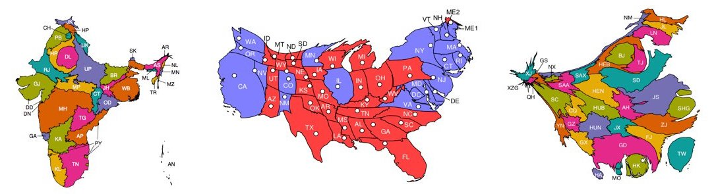
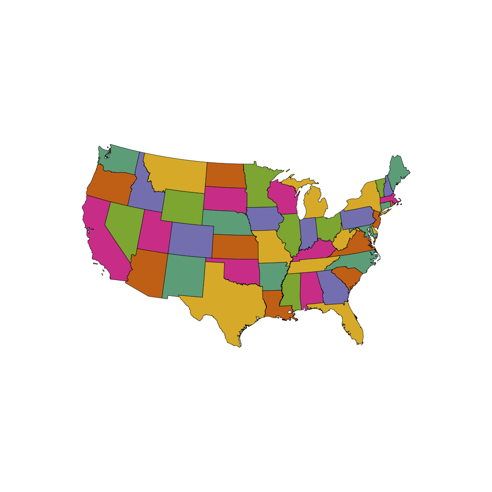
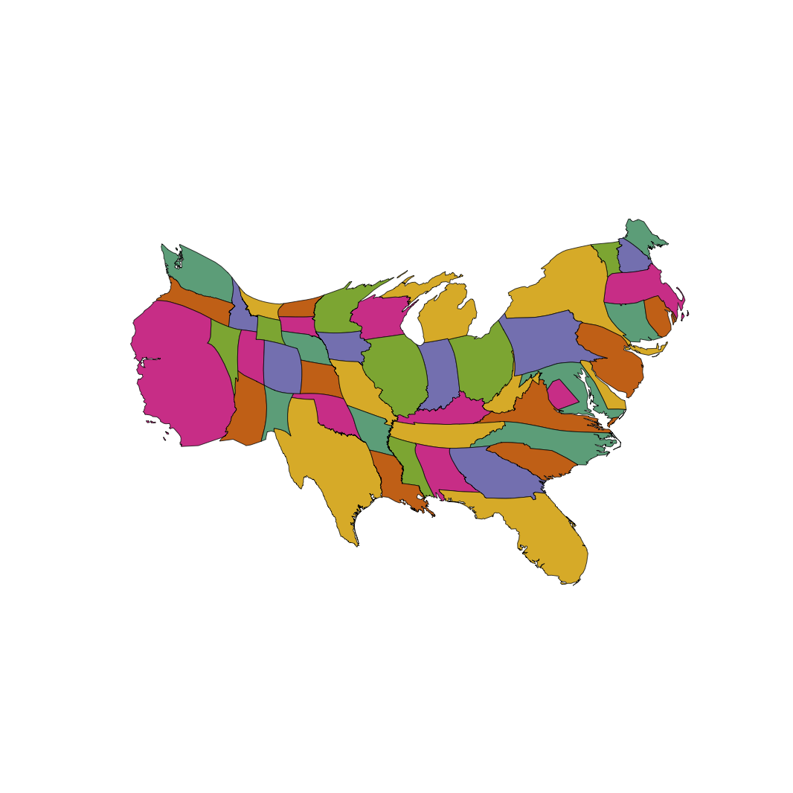

# Flow-Based Cartogram Generator

<p align="center">


</p>

<p align="center">

</p>

## Table Of Contents
- [Introduction](#introduction)
- [Input data format](#input-data-format)
- [Building the cartogram generator](#building-the-cartogram-generator)
- [Running the cartogram generator](#running-the-cartogram-generator)
  * [Processing Your Map](#processing-your-map-geojson)
  * [Examples](#examples)
  * [Options](#options)
- [Troubleshooting](#troubleshooting)

<hr>

[](https://github.com/Flow-Based-Cartograms/go_cart/releases/latest)
[](https://GitHub.com/Naereen/StrapDown.js/graphs/commit-activity)
[](http://hits.dwyl.io/Flow-Based-Cartograms/go_cart)
[](https://twitter.com/intent/tweet?url=https%3A%2F%2Fgithub.com%2FFlow-Based-Cartograms%2Fgo_cart&text=Create%20your%20own%20cartograms%20today%20-%20and%20see%20what%20your%20world%20really%20looks%20like%21&hashtags=data%2Cmap%2Ccartogram%2Ctech)


## Introduction
We present a fast <a href="https://en.wikipedia.org/wiki/Cartogram" target="\_blank" title="What are Cartograms?">cartogram</a> generator written in C. It uses the flow-based algorithm devised by <a href="https://doi.org/10.1073/pnas.1712674115" target="\_blank">Gastner, Seguy & More</a>.

This readme explains how to set up and use this software. 
In doing so, it uses data from the 2016 United States presidential election. 
These data are included in the repository.

**Note:** Any images generated using this software should be referenced to:

Gastner, M., Seguy, V., & More, P. (2018). Fast flow-based algorithm for creating density-equalizing map projections. *Proceedings of the National Academy of Sciences USA*, **115**:E2156-E2164.

**BibTeX Entry:**

```
@article{gastner_seguy_more_2018,
	title={Fast flow-based algorithm for creating density-equalizing map projections},
	author={Gastner, Michael T. and Seguy, Vivien and More, Pratyush},
	DOI={10.1073/pnas.1712674115},
	journal={Proceedings of the National Academy of Sciences of the United States of America},
	year={2018},
	volume = {115},
	number = {10},
	pages = {E2156--E2164}
}
```

## Input data format
The cartogram generator expects two input files.

1. a '.json' file containing the cartesian coordinates for the map regions under consideration. For example, for the 2016 US presidential election data we provide `usa_contiguous_arcgis.json` (in the `sample_data` folder) which includes the coordinates for the boundaries of the different states of the contiguous United States. You will need to obtain the '.json' file and it needs to adhere to the GeoJSON specifications. It also needs to be processed first by using the command `cartogram -p [json_file_name]` (Instructions found [below](#running-the-cartogram-generator)).  If you do not have a '.json' file, please follow the steps listed here: https://github.com/Flow-Based-Cartograms/go_cart/blob/master/process_map_file.md

2. a '.csv' file containing the data (such as population) for each region, according to which these will be scaled. For the 2016 US presidential election data we provide `usa_contiguous_electors.csv` (in the `sample_data` folder) which provides the number of electors for each state. The csv file will be generated by the cartogram generator when you process the '.json' file. You will then need to add in the data to the csv file.

The `.csv` file should be in the following format:
```
Region.Id,Region.Data,Region.Name
1,9,Alabama
2,11,Arizona
3,6,Arkansas
4,55,California
5,9,Colorado
6,7,Connecticut
7,3,Delaware
8,3,District of Columbia
...
```

## Building the cartogram generator

### Dependencies

#### macOS
You must have `Xcode Command Line Tools` and the `brew` package manager <a href="https://www.moncefbelyamani.com/how-to-install-xcode-homebrew-git-rvm-ruby-on-mac/" title="How to install Xcode CLT & brew?" target="\_blank">installed</a> (and updated) on your computer.

#### Ubuntu/Debian Linux

No additional dependencies. Your default `apt-get` package manager should work fine.

#### Windows 10

Install Bash for Windows 10 following <a href='https://itsfoss.com/install-bash-on-windows/'>these instructions</a>. Use this Bash terminal in the build steps.

### Building (macOS, Linux, & Windows 10)

1. Open a terminal, clone the repository, and navigate to its root directory.

2. Run the provided automatic build script. This will install the required dependencies and run configure and make for you:
```
./autobuild.sh
```

3. The `cartogram` executable can be found in the root directory of the repository. To add the generator to your list of binaries, and access it outside this directory, please run the following command:
```
sudo make install
```

4. Once you have installed it, you can run the cartogram generator at the command line by running `cartogram`. You should see the following output:
```
$ cartogram
USAGE:
Process GeoJSON File: cartogram -p json_file_name
Generate Cartogram:   cartogram [-dei] -g map_file_name -a area_file_name
                      OR:
                      cartogram [-dei] -g map_file_name -s
-d: use Gastner-Newman (i.e. diffusion) method
-e: generate cartogram figure in EPS format
-i: calculate inverse transform
```

**Note:** If you run into issues, look at the [**Troubleshooting**](#troubleshooting) section below.

## Running the cartogram generator

To generate a cartogram, you need a map and the associated statistical data you want to visualize. The cartogram generator accepts maps in GeoJSON and ArcInfo Generate formats, and statistical data in CSV format. To generate a cartogram, you need to:

1. Process the original map (you only need to do this once)
2. Generate a CSV file with the data you want to visualize
3. Run the cartogram generator

### Processing Your Map (GeoJSON)

Process your GeoJSON map file using the following command:
```
cartogram -p json_file_name
```

The cartogram will generate 2 new files: a processedmap '.json' file and '.csv' file. Open the CSV file with your preferred spreadsheet program, and fill in the data value for each region under the 'Region Data' column.

### Processing Your Map (ArcInfo Generate)

Please note that support for the ArcInfo Generate format is provided for backwards compatability with existing maps. New maps should use the GeoJSON format. While you do not need to run a command to process the map file, you need to genenate the CSV file containing the statistical data you want to visualize manually. It should contain two columns:

1. `Region Id`, which corresponds to the region IDs in the map file
2. `Region Data`, which contains the data for each region

### Generating a Cartogram

Once you have processed your map file and generated a CSV file with the data you want to visualize, you can run the following command to generate a cartogram:

```
cartogram -g processedmap_file_name -a csv_file_name
```

The generated cartogram will be saved in the same format as the map input in the current working directory with the filename:

- `cartogram.json`, if the input map is in GeoJSON format
- `cartogram.gen`, if the input map is in ArcInfo Generate format

### Examples

For the 2016 US presidential election data, navigate to the `sample_data/` directory.

```
cd sample_data/
```

Then run the following command. Note that the sample data has **already been processed** using `cartogram -p`
```
cartogram -g usa_contiguous_arcgis.json -a usa_contiguous_electors.csv
```

To generate an EPS image of the original map and cartogram, use the `-e` option:
```
cartogram -eg usa_contiguous_arcgis.json -a usa_contiguous_electors.csv
```
Running this command will produce three files:

- `cartogram.json` contains the cartogram in GeoJSON format
- `map.eps` contains the original map in EPS format
- `cartogram.eps` contains the generated cartogram in EPS format

On macOS, you can view EPS files with the command:
```
open <filename>.eps
```
On Linux, run the following instead:
```
evince <filename>.eps
```
Replace `<filename>` with the name of the file (`map` or `cartogram`) you wish to open.

For our example, `map.eps` should look as follows:

<p align="center">

</p>

`cartogram.eps` should look like:

<p align="center">

</p>

### Options

**-e**<br/>
> Output an EPS file of the original map (`map.eps`) and the cartogram (`cartogram.eps`)

**-d**<br/>
> Use Gastner-Newman (i.e. diffusion) instead of fast flow-based method

**-i**<br/>
> Print inverse transform to file

**-g**<br/>
> Location of file for the original map

**-a**<br/>
> Location of the area information file. Cannot be used with **-s**.

**-s**<br/>
> Read the area information from `stdin`, and output the cartogram gen file to `stdout`. Cannot be used with **-a**.


## Troubleshooting
In case you run into problems while building the generator using the automated script, you could try manually carrying out some of the steps.

#### macOS
1. Install fftw and gcc.
```
brew install fftw && brew link fftw
brew install gcc
```

2. Note down the version of `gcc` installed. For example, if `gcc-8.1.0` is installed, your version would be `8` (not 8.1.0).

3. Run autogen and configure,  pass it the compiler information
```
$ ./autogen.sh
$ CC=gcc-[your-version-number] ./configure
```

4. Run make
```
$ make
```

#### Ubuntu/Debian Linux
1. Make sure everything is up to date. Then install fftw and gcc.
```
sudo apt-get update
sudo apt-get install libfftw3-3 libfftw3-dev
sudo apt-get install build-essential
```

2. Make sure you are in the root directory, and then run the remaining steps.
```
$ ./autogen.sh && ./configure && make
```

#### Windows: Older Versions
If you have an earlier edition of Windows you can still build `cartogram`: 

1. Install <a href="https://cygwin.com/install.html">cygwin</a> including the base and devel categories along with fftw3 and fftw3-devel.
2. Download the source code for <a href="https://github.com/DaveGamble/cJSON"> cJSON </a> and follow the instructons to compile and link with pkg-config using the cygwin directory structure:
    ```
    mkdir build
    cd build
    cmake .. -DCMAKE_INSTALL_PREFIX=/
    make
    make install
    ```
3.  You may need to convert newline characters in the go-cart main directory:
    ```
    dos2unix autogen.sh
    dos2unix autobuild.sh
    ```
4. Run autogen:
    ```
   ./autogen.sh
    ```
5. Follow the build instructions below for macOS & Linux

#### Error (macOS): Don't understand 'm' flag!

If you see the following line in your output, you may want to take a look at <a href="https://github.com/dmlc/xgboost/issues/1945" target="\_blank">this solution</a>.
```
FATAL:/opt/local/bin/../libexec/as/x86_64/as: I don't understand 'm' flag!
```
